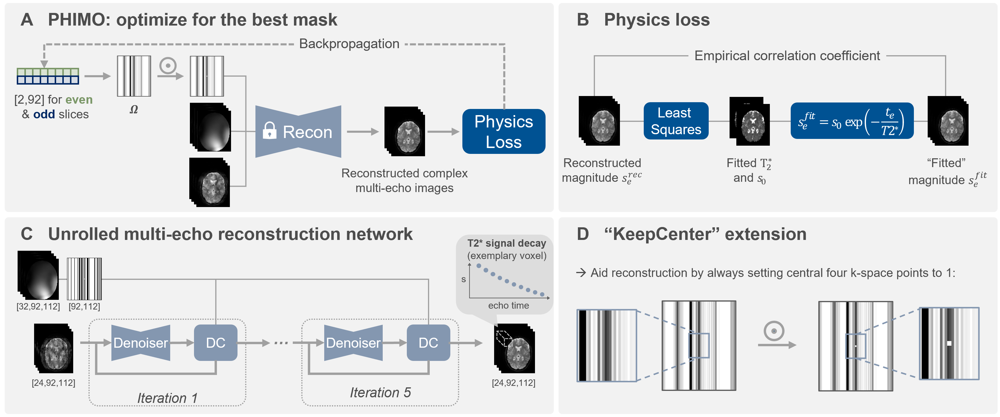

# PHIMO+: Motion-Robust T2* Quantification from Low-Resolution Gradient Echo MRI with Physics-Informed Deep Learning

**Hannah Eichhorn**, Veronika Spieker, Kerstin Hammernik, Elisa Saks, Lina Felsner, Kilian Weiss, Christine Preibisch, Julia A. Schnabel

**Accepted at Magnetic Resonance in Medicine** | Preprint available at: [arXiv:2502.17209](https://arxiv.org/abs/2502.17209)

**Data-Consistent Image Reconstruction | Self-Supervised Optimization | Motion Correction | 
Motion Detection | Motion Simulation**

**Abstract:** 
<br>
_Purpose_: T2* quantification from gradient echo magnetic resonance imaging
is particularly affected by subject motion due to the high sensitivity to
magnetic field inhomogeneities, which are influenced by motion and might
cause signal loss. Thus, motion correction is crucial to obtain high-quality
T2* maps.
<br>
_Methods_: We extend PHIMO, our previously introduced learning-based
physics-informed motion correction method for low-resolution T2* mapping.
Our extended version, PHIMO+, utilizes acquisition knowledge to enhance the 
reconstruction performance for challenging motion patterns and increase 
PHIMO’s robustness to varying strengths of magnetic field inhomogeneities 
across the brain. We perform comprehensive 
evaluations regarding motion detection accuracy and image quality
for data with simulated and real motion.
<br>
_Results_: Our extended version of PHIMO outperforms the learning-based
baseline methods both qualitatively and quantitatively with respect to line
detection and image quality. Moreover, PHIMO performs on-par with a
conventional state-of-the-art motion correction method for T2*
quantification from gradient echo MRI, which relies on redundant data acquisition.
<br>
_Conclusion_: PHIMO’s competitive motion correction performance, combined 
with a reduction in acquisition time by over 40% compared to the
state-of-the-art method, make it a promising solution for motion-robust
T2* quantification in research settings and clinical routine.


## Citation
If you use this code, please cite our arXiv preprint:

```
@misc{eichhorn2025,
      title={Motion-Robust {T2*} Quantification from Gradient Echo MRI with Physics-Informed Deep Learning}, 
      author={Hannah Eichhorn and Veronika Spieker and Kerstin Hammernik and Elisa Saks and Lina Felsner and Kilian Weiss and Christine Preibisch and Julia A. Schnabel},
      year={2025},
      eprint={2502.17209},
      archivePrefix={arXiv},
      url={https://arxiv.org/abs/2502.17209}, 
}
```

## Illustration of PHIMO+:
<p align="center">

</p>

<p style="text-align: justify;">
Illustration of PHIMO+. 
(A) Subject-specific MoCo of *motion-corrupted* data: optimizing one exclusion mask, $\Omega$, for even and one odd slices. 
(B) Empirical correlation coefficient as physics-informed loss for the self-supervised optimization of the exclusion masks in (A).
(C) Training an unrolled reconstruction network with randomly undersampled *motion-free* multi-echo data. 
(D) *KeepCenter* extension: always keep the central four k-space points regardless of their motion status to avoid severe contrast loss.
</p>

## Contents of this repository:

- `iml-dl`: code belonging to the above work, using an adapted version of the [IML-CompAI Framework](https://github.com/compai-lab/iml-dl) and the [MERLIN Framework](https://github.com/midas-tum/merlin). The weights of the trained models are not shared, since the training was performed on private data.

All computations were performed using Python 3.8.12 and PyTorch 2.0.1. 


## Setup:

1. Create a virtual environment with the required packages:
    ```
    cd ${TARGET_DIR}/PHIMO
    conda env create -f conda_env.yml
    source activate phimo *or* conda activate phimo
    ```

2. Install pytorch with cuda:
    ```
    conda install pytorch torchvision torchaudio pytorch-cuda=11.7 -c pytorch -c nvidia
    pip install torchinfo
    conda install -c conda-forge pytorch-lightning
    ```

3. For setting up wandb please refer to the [IML-CompAI Framework](https://github.com/compai-lab/iml-dl).


## Steps to reproduce the analysis:

1. Start all scripts from the main directory and activate the conda environment:
    ```
    cd ${TARGET_DIR}/PHIMO-mrm/iml-dl/
    conda activate phimo_mrm
    ```
   

2. Create symbolic links to data (under `iml-dl/data/links_to_data/`) with the script `create_symbolic_links.py` - adjust the paths in the script 
to your data location, then run:
    ```
    python -u ./data/preprocessing/create_symbolic_links.py
    ```
   

3. Run the following commands for training the unrolled reconstruction networks:
   ```
   python -u ./core/Main.py --config_path ./projects/recon_t2star/configs/mrm/config_{Random_KeepCenter or Random_NoKeepCenter or VarDens_KeepCenter}.yaml
   ```


4. Run the following commands for simulating motion in the raw data (test, train and val sets):
   ```
   nohup python -u ./projects/motion_simulation/simulator.py --config_path ./projects/motion_simulation/configs/config_simulate_{test or train or val}.yaml > "{path_to_output_logfile}" &
   ```
   Then run the script `projects/motion_simulation/prepare_mqbold_processing.py` (adjust file paths) to prepare the 
   simulated data for processing in the MATLAB mqBOLD pipeline and run this pipeline on the simulated data.


5. Prepare for the self-supervised motion correction:
   1. Get the slice ranges for each subject for optimizing the MLP in the Even/Odd setting: run the script 
   `projects/moco_t2star/get_train_slices_susceptibility.py`.
   2. (If applicable), transform the motion timing instructions into masks with the script 
   `projects/moco_t2star/motion_timing_experiment.py` (adjust file paths).


6. Run the following commands for the self-supervised line detection and subsequent correction (PHIMO):
   ```
   python -u ./core/Main.py --config_path ./projects/moco_t2star/configs/mrm/real_motion/config_test_base_KeepCenter-EvenOdd.yaml
   ```
   and similar for all other config files in `./projects/moco_t2star/configs/mrm/real_motion/` and `./projects/moco_t2star/configs/mrm/simulated_motion/`.
   Note: this needs to be run for each subject separately. Exchange the `select_one_scan` variable in the config file for that.
   For training multiple models in parallel/sequentially, use the script `train_multiple.sh` and choose the desired test set:
   ```
   cd ${TARGET_DIR}/PHIMO-mrm/iml-dl/projects/moco_t2star/
   nohup bash train_multiple.sh &
   ```
   

7. Train the supervised line detection with simulated data as comparison:
    ```
    nohup python -u ./core/Main.py --config_path ./projects/line_detection_t2star/configs/config_train.yaml
    ```
   

8. For the evaluation of results and creation of plots for the paper, run the following scripts:
   - `projects/moco_t2star/mrm/eval_moco.py` for the evaluation of the real motion data (test set, MoCo validation set and extreme motion case),
   - `projects/moco_t2star/mrm/eval_moco_simulated.py` for the evaluation of the simulated motion data,
   - `projects/moco_t2star/mrm/eval_moco_motionfree.py` for the evaluation of the motion-free data,
   - `projects/moco_t2star/mrm/validation_exp.py` for the validation experiments.
